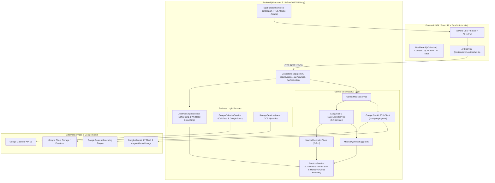
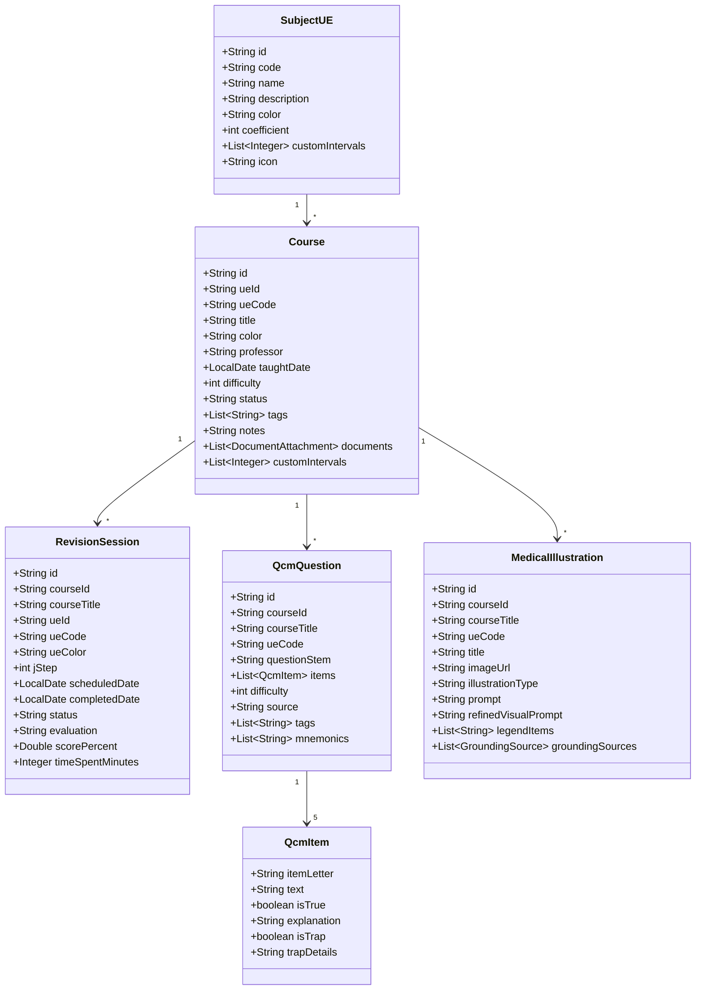

# AGENTS.md — MedJ Codebase Architecture & Operational Guide

> **Document Version**: 1.0.0  
> **Last Updated**: 2026-08-18  
> **Target Audience**: AI Agents (Antigravity, coding assistants) and Software Engineers working on the **MedJ** repository.

---

## 1. Executive Summary & Purpose

**MedJ** (*Méthode des J & IA Gemini pour Étudiants en Médecine*) is a high-performance, full-stack educational web application and Progressive Web App (PWA) tailored specifically for French medical students preparing for the competitive **PASS** (*Parcours Accès Santé Spécifique*) and **LAS** (*Licence Accès Santé*) university examinations.

### Core Value Propositions
1. **Automated Spaced Repetition (Méthode des J)**:
   - Configurable review cycles ($J_0, J_1, J_3, J_7, J_{14}, J_{30}, J_{60}$) calculated dynamically from course dates.
   - **Pedagogical Workload Smoothing (*Lissage de Charge*)**: Automatic rebalancing of overloaded days into adjacent lighter days, prioritizing adjustments to late-stage cycles ($J_{30}, J_{60}$) while preserving critical early memory consolidation ($J_0, J_1, J_3$).
   - Granular adjustments: bulk shifting per Teaching Unit (*Unité d'Enseignement - UE*) or single-session shifts.

2. **Multimodal Google Gemini AI Integration**:
   - **Official PASS QCM Generator**: Strict 5-proposition format ($A, B, C, D, E$) with independent True/False grading, official scoring heuristics, trap detection (*inversion droite/gauche*, *distal/proximal*, *fausses valeurs numériques*), and mnemonics.
   - **Handwritten Notes & Summary Scanner (*Fiches de Révision*)**: Multimodal OCR and structured extraction of markdown summaries, anatomical terms, key figures, and exam traps from photos or PDFs.
   - **Annale / Exam OCR Scanner**: Converts photos or scanned documents of past exam papers into interactive digital quiz items.
   - **Grounded AI Medical Tutor**: Conversational PASS tutor using LangChain4j and Google GenAI SDK with autonomous tool-calling (`createAndSaveQcm`, `createAndSaveMedicalIllustration`) and real-time **Google Search Grounding** with clickable source citations.
   - **Medical Illustration & Fill-in-the-Blank Generator**: High-fidelity anatomical diagrams and numbered printable worksheets (*planches d'entraînement à trous*) with French medical nomenclature (*Terminologia Anatomica*), automated multimodal fact-checking, and interactive regeneration.

3. **Google Calendar & iCal Synchronization**:
   - Direct export and live calendar subscription via standard iCalendar feed (`/api/calendar/feed.ics`).
   - OAuth2 synchronization to a dedicated Google Calendar (*"MedJ - Révisions PASS"*).

---

## 2. System Architecture



---

## 3. Technology Stack

| Layer | Technology | Version | Purpose / Rationale |
| :--- | :--- | :--- | :--- |
| **Backend Runtime** | GraalVM CE | GraalVM 25 (Java 25) | Ultra-fast execution, minimal memory footprint, and native image ahead-of-time (AOT) readiness. |
| **Backend Framework** | Micronaut Framework | 5.1.0 | Fast startup (<1s), Netty HTTP server, compile-time dependency injection and reflection-free Serde. |
| **Serialization** | Micronaut Serde Jackson | 5.1.0 | Compile-time `@Serdeable` DTO code generation, avoiding runtime reflection. |
| **AI SDK (Direct)** | `com.google.genai:google-genai` | 1.57.0 | Official Google GenAI Java SDK for structured outputs (JSON Schemas) and multimodal input. |
| **AI Framework (Agentic)** | LangChain4j (`langchain4j-google-genai`) | 1.18.0 / 1.19.0-beta29 | High-level `@AiServices` abstraction for conversational agent with `@Tool` calling and Search Grounding. |
| **PDF Processing** | Apache PDFBox | 3.0.4 | Parsing scanned documents and course syllabus PDFs. |
| **Cloud Services** | Google Cloud Firestore & Storage, Google Calendar API | Latest | Cloud persistence, file hosting, and calendar synchronization. |
| **Frontend Framework** | React | 19.0.0 | Latest React declarative UI with concurrent rendering and hooks. |
| **Frontend Tooling** | Vite & TypeScript | Vite 6.1.0, TS 5.7.3 | Blazing fast HMR, type safety, and optimized production bundling. |
| **Frontend Styling** | Tailwind CSS | 3.4.17 | Utility-first, responsive dark-mode palette optimized for medical study ergonomics. |
| **Math & Markdown** | `react-markdown`, `remark-math`, `rehype-katex`, `KaTeX` | Latest | High-fidelity rendering of LaTeX physiological formulas ($V_d$, $Cl$, $pH$, Michaelis-Menten). |
| **Build System** | Gradle (Groovy DSL) + `gradle-node-plugin` | Gradle 8.x/9.x, Node Plugin 7.0.2 | Hermetic, zero-external-dependency builds downloading isolated Node.js 22 & npm 10. |

---

## 4. Key Technical Decisions & Architectural Rationale

### 1. Dual AI Engine Strategy (Google GenAI SDK + LangChain4j)
- **Direct Google GenAI SDK (`com.google.genai.Client`)**:
  - Used for strict, deterministic tasks such as QCM generation (`generatePassQcm`), annale OCR (`scanExistingQcmAnnales`), and handwritten note extraction (`scanHandwrittenNotes`).
  - Utilizes `com.google.genai.types.Schema` structured output definitions to guarantee 100% valid JSON conforming to medical exam specifications.
- **LangChain4j (`PassTutorAiService`)**:
  - Used for the interactive conversational tutor.
  - Equips the tutor with autonomous `@Tool` execution capabilities via `MedicalQcmTools` and `MedicalIllustrationTools`.
  - Enables the AI to persist QCMs and generate medical diagrams in the background while conversing with the student.

### 2. Google Search Grounding with Transparent Web Citations
- Responses from Gemini 3.7 Flash use Google Search Grounding (`enableGoogleSearch(true)` or `Tool.builder().googleSearch(...)`).
- Raw `GroundingMetadata` chunks (`GroundingChunkWeb`) are extracted and parsed into clean `GroundingSource` records with domain filtering.
- Source badges and markdown references are automatically appended to answers and displayed in the UI, allowing students to verify medical facts against authoritative sources (HAS, ANSM, Collèges Médicaux).

### 3. Resilient Offline-First / Zero-Cloud Fallback
- When `GEMINI_API_KEY` or Google Cloud credentials are not configured, MedJ operates without error in **offline/demo mode**.
- Fallback engines provide:
  - Realistic medical datasets for French PASS UEs (Anatomy, Pharmacology, Cell Biology, Biophysics, SSH).
  - Algorithmic SVG generators for anatomical illustrations.
  - In-memory mock repositories (`ConcurrentHashMap`) in `FirestoreService`.

### 4. Workload Smoothing Algorithm (*Lissage de Charge*)
- When daily scheduled reviews exceed `dailyOverloadThreshold` (default: 6 sessions/day):
  - Sessions with higher $J$-steps (e.g. $J_{30}, J_{60}$) are shifted first to the closest subsequent under-capacity day.
  - Early-stage repetitions ($J_0, J_1, J_3$) remain anchored on their target dates to prevent memory curve degradation.

### 5. Unified Single-Artifact Packaging
- Gradle's `buildFrontend` task triggers `npm run build` into `frontend/dist/`.
- `processResources` copies `frontend/dist/` into `classpath:public/`.
- `SpaFallbackController` routes non-API, non-asset paths to `index.html`, allowing the entire application (API + UI) to execute from a single standalone jar.

---

## 5. Repository Structure & Map

```
medj/
├── AGENTS.md                                # This document (AI Agent operational handbook)
├── README.md                                # User & Developer quickstart guide
├── build.gradle                             # Micronaut & Gradle build script + Node packaging
├── settings.gradle                          # Project name and plugin repositories
├── gradle.properties                        # JVM arguments & Gradle caching options
├── gradlew / gradlew.bat                    # Gradle wrapper executables
├── uploads/                                 # Local storage fallback directory for files & scans
├── src/
│   ├── main/
│   │   ├── java/fr/medj/
│   │   │   ├── Application.java             # Micronaut Main Entrypoint
│   │   │   ├── controller/
│   │   │   │   ├── CalendarController.java   # Calendar sync & iCal (.ics) feed endpoints
│   │   │   │   ├── CourseController.java     # Courses, Subject UEs & File uploads
│   │   │   │   ├── GeminiAiController.java   # QCM gen, scans, tutor chat, illustrations
│   │   │   │   ├── RevisionController.java   # J-Method sessions, completion, workload & smoothing
│   │   │   │   └── SpaFallbackController.java# Single Page Application HTML5 fallback router
│   │   │   ├── model/
│   │   │   │   ├── AiTutorMessage.java       # Chat messages with tool-created QCMs/illustrations
│   │   │   │   ├── Course.java               # Medical course definition with custom intervals
│   │   │   │   ├── GroundingSource.java      # Google Search Grounding citation (title, uri, domain)
│   │   │   │   ├── HandwrittenScanResult.java# OCR markdown, anatomical terms, traps & numbers
│   │   │   │   ├── IllustrationVerification.java # Fact-checking report for generated drawings
│   │   │   │   ├── ItemVerification.java     # Individual QCM item (A-E) verification outcome
│   │   │   │   ├── JScheduleConfig.java      # Spaced repetition configuration & thresholds
│   │   │   │   ├── MedicalIllustration.java  # Anatomical diagram & fill-in-the-blank model
│   │   │   │   ├── QcmAttempt.java           # Student quiz attempt & scoring history
│   │   │   │   ├── QcmItem.java              # Single QCM proposition (A-E, True/False, Trap)
│   │   │   │   ├── QcmQuestion.java          # 5-item PASS question stem, mnemonics & tags
│   │   │   │   ├── QcmVerificationResult.java# Full QCM fact-checking result with corrected QCM
│   │   │   │   ├── RevisionSession.java      # Scheduled J-session (J0..J60) with status & rating
│   │   │   │   ├── SubjectUE.java            # Medical Teaching Unit (UE1 to UE7, Mineure)
│   │   │   │   └── TutorConversationThread.java # Conversational thread history
│   │   │   └── service/
│   │   │       ├── FirestoreService.java     # Primary data repository (Memory / Firestore)
│   │   │       ├── GeminiMedicalService.java # Core Gemini SDK client, prompts, OCR & verification
│   │   │       ├── GoogleCalendarService.java# Google Calendar API & iCalendar generator
│   │   │       ├── JMethodEngineService.java # Spaced repetition calculator & workload smoothing
│   │   │       ├── MedicalIllustrationTools.java # LangChain4j @Tool for medical diagrams
│   │   │       ├── MedicalQcmTools.java      # LangChain4j @Tool for QCM persistence
│   │   │       ├── PassTutorAiService.java   # LangChain4j @AiServices interface & system prompt
│   │   │       └── StorageService.java       # Local filesystem & GCS file manager
│   │   └── resources/
│   │       ├── application.yml              # Server, Security, Gemini & GCP configuration
│   │       └── logback.xml                  # Logging configuration
│   └── test/
│       ├── java/fr/medj/
│       │   ├── GroundingTutorTest.java      # Google Search Grounding extraction & serialization tests
│       │   ├── JMethodEngineServiceTest.java# Workload smoothing & session generation tests
│       │   ├── MedicalQcmToolsTest.java     # LangChain4j @Tool execution & persistence tests
│       │   ├── QcmCrudTest.java             # QCM creation, filtering & retrieval tests
│       │   ├── QcmVerificationTest.java     # QCM fact-checking & correction pipeline tests
│       │   └── SubjectCrudTest.java         # Subject UE creation & validation tests
│       └── resources/
│           └── application-test.yml         # Test environment configuration
└── frontend/
    ├── package.json                         # Frontend dependencies & npm scripts
    ├── tsconfig.json / vite.config.ts       # TypeScript & Vite bundler settings (API proxy on :8080)
    ├── tailwind.config.js / postcss.config.js # Tailwind CSS configuration
    ├── index.html                           # HTML5 host page
    └── src/
        ├── App.tsx                          # Root React component, router & state manager
        ├── main.tsx                         # React 19 DOM entrypoint
        ├── types.ts                         # TypeScript domain models matching backend Serde DTOs
        ├── index.css                        # Tailwind directives & custom CSS animations
        ├── context/ThemeContext.tsx         # Dark/Light theme state
        ├── services/api.ts                  # Typed Axios/Fetch wrapper for all backend endpoints
        ├── utils/
        │   ├── dateUtils.ts                 # Date formatting & timezone-safe helpers
        │   └── printWorksheet.ts            # Print stylesheet generator for blank worksheets
        ├── hooks/useEscapeKey.ts            # Keyboard shortcut helper for closing modals
        └── components/
            ├── Navbar.tsx                   # Top navigation with sync button & badge count
            ├── DashboardView.tsx            # Today's due revisions, overdue alerts & stats
            ├── JCalendarView.tsx            # Interactive monthly/weekly planning & drag-shift
            ├── CourseListView.tsx           # Course index grouped by UE with filter chips
            ├── CourseDetailView.tsx         # Full course view with sessions, QCMs & notes
            ├── QcmBankView.tsx              # Searchable QCM database with verification badges
            ├── QcmTrainerModal.tsx          # Interactive quiz modal with PASS grading scale
            ├── QcmVerificationModal.tsx     # Fact-checking review modal with 1-click apply
            ├── AiTutorChat.tsx              # Interactive tutor chat with tool artifacts
            ├── GeminiScannerModal.tsx       # Multimodal scanner for fiches & exam papers
            ├── MedicalIllustrationModal.tsx # Diagram viewer with maskable legend & zoom
            ├── NewIllustrationModal.tsx     # Direct diagram prompt generation modal
            ├── NewCourseModal.tsx           # New course creation modal with J0 scheduling
            ├── EditQcmModal.tsx             # QCM editor with 5-item A-E validator
            ├── EditSubjectModal.tsx         # Subject UE customization modal
            ├── AddRevisionModal.tsx         # Manual revision session scheduler
            ├── SettingsModal.tsx            # Spaced repetition intervals & threshold config
            ├── ProgressionChart.tsx         # Visual progress tracking
            ├── MarkdownRenderer.tsx         # KaTeX math & Markdown renderer
            └── FullscreenImageViewer.tsx   # Zoomable high-res medical image lightbox
```

---

## 6. Domain Data Models



---

## 7. REST API Reference

### 7.1 Subjects & Courses (`/api`)
| Method | Path | Request Body | Description |
| :--- | :--- | :--- | :--- |
| `GET` | `/api/subjects` | — | Retrieves all medical UEs (UE1 to UE7 + Mineure). |
| `POST` | `/api/subjects` | `SubjectUE` | Creates a new UE. |
| `PUT` | `/api/subjects/{id}` | `SubjectUE` | Updates an existing UE and cascades colors to courses. |
| `DELETE` | `/api/subjects/{id}` | — | Deletes a UE. |
| `GET` | `/api/courses` | Query: `ueId` (opt) | Retrieves all courses, optionally filtered by UE. |
| `GET` | `/api/courses/{id}` | — | Retrieves a single course. |
| `POST` | `/api/courses` | `Course` | Creates a course and automatically generates J-Method sessions. |
| `PUT` | `/api/courses/{id}` | `Course` | Updates course details and propagates color changes to sessions. |
| `DELETE` | `/api/courses/{id}` | — | Deletes a course and its associated revision sessions. |

### 7.2 Spaced Repetition & Workload (`/api/revisions`)
| Method | Path | Request Body | Description |
| :--- | :--- | :--- | :--- |
| `GET` | `/api/revisions` | Query: `date`, `courseId`, `ueId`, `status` | Filters revision sessions by multiple criteria. |
| `GET` | `/api/revisions/today` | — | Retrieves today's summary (due today, overdue, completed today). |
| `GET` | `/api/revisions/workload`| Query: `start`, `end` | Workload distribution map and list of overloaded dates. |
| `POST` | `/api/revisions/{id}/complete` | `CompleteSessionRequest` | Marks session as completed with grade and time spent. |
| `POST` | `/api/revisions/{id}/uncomplete` | — | Resets a session back to pending/overdue. |
| `POST` | `/api/revisions/{id}/shift` | `ShiftSessionRequest` (`daysToAdd`) | Shifts a single session by $+N$ days. |
| `POST` | `/api/revisions/shift-subject` | `ShiftSubjectRequest` (`ueId`, `daysToAdd`) | Bulk shifts all upcoming sessions for an entire UE. |
| `POST` | `/api/revisions/smooth-workload` | `SmoothWorkloadRequest` (`dailyLimit`) | Executes intelligent workload smoothing algorithm. |
| `POST` | `/api/revisions` | `CreateRevisionRequest` | Creates a custom revision session for a course. |
| `DELETE` | `/api/revisions/{id}` | — | Deletes an individual revision session. |

### 7.3 Gemini AI & Multimodal Endpoints (`/api/gemini`)
| Method | Path | Request Body | Description |
| :--- | :--- | :--- | :--- |
| `POST` | `/api/gemini/generate-qcm` | `GenerateQcmRequest` | Generates PASS-compliant QCMs from course text using Gemini 3.7 Flash with JSON Schema. |
| `POST` | `/api/gemini/scan-annale` | Multipart (`file`) | Multimodal OCR of exam papers/PDFs into interactive QCM questions. |
| `POST` | `/api/gemini/scan-handwritten` | Multipart (`file`) | Multimodal extraction of handwritten fiches into structured markdown, terms, and traps. |
| `POST` | `/api/gemini/tutor` | `AskTutorRequest` | Conversational PASS tutor with LangChain4j `@Tool` calls and Google Search Grounding. |
| `GET` | `/api/gemini/tutor/threads` | Query: `courseId` (opt) | Lists all or course-specific tutor conversation threads. |
| `POST` | `/api/gemini/tutor/threads` | `CreateThreadRequest` | Creates a new tutor conversation thread. |
| `DELETE` | `/api/gemini/tutor/threads/{id}` | — | Deletes a conversation thread. |
| `GET` | `/api/gemini/qcms` | Query: `courseId` (opt) | Lists persisted QCMs. |
| `POST` | `/api/gemini/qcms` | `QcmQuestion` | Saves a custom or AI-generated QCM. |
| `PUT` | `/api/gemini/qcms/{id}` | `QcmQuestion` | Updates a QCM. |
| `DELETE` | `/api/gemini/qcms/{id}` | — | Deletes a QCM. |
| `POST` | `/api/gemini/qcms/{id}/verify` | — | Audits and fact-checks a QCM against Google Search Grounding, producing corrections. |
| `POST` | `/api/gemini/verify-qcm` | `QcmQuestion` | Fact-checks an arbitrary QCM payload. |
| `POST` | `/api/gemini/qcm-attempts` | `QcmAttempt` | Records student score and stats for an exam session. |
| `GET` | `/api/gemini/qcm-attempts` | Query: `courseId` (opt) | Retrieves attempt history. |
| `POST` | `/api/gemini/illustrations/generate` | `GenerateIllustrationRequest` | Generates anatomical diagram or printable fill-in-the-blank drawing via `gemini-3-pro-image`. |
| `POST` | `/api/gemini/illustrations/{id}/regenerate` | `RegenerateIllustrationRequest` | Re-generates illustration with prompt adjustments. |
| `POST` | `/api/gemini/illustrations/{id}/verify` | — | Multimodal visual inspection & fact-checking of generated illustrations. |
| `GET` | `/api/gemini/illustrations` | Query: `courseId` (opt) | Lists generated illustrations. |
| `DELETE` | `/api/gemini/illustrations/{id}` | — | Deletes an illustration. |
| `GET` | `/api/gemini/flashcards` | Query: `courseId` (opt) | Lists active recall flashcards. |
| `POST` | `/api/gemini/flashcards` | `Flashcard` | Creates a new flashcard. |
| `PUT` | `/api/gemini/flashcards/{id}` | `Flashcard` | Updates a flashcard. |
| `DELETE` | `/api/gemini/flashcards/{id}` | — | Deletes a flashcard. |
| `POST` | `/api/gemini/flashcards/{id}/favorite` | — | Toggles star favorite status. |
| `POST` | `/api/gemini/flashcards/{id}/review` | `ReviewFlashcardRequest` | Records spaced repetition review rating (AGAIN/HARD/GOOD/EASY). |
| `POST` | `/api/gemini/flashcards/{id}/verify` | — | Fact-checks a flashcard with LLM-as-Judge & Google Search Grounding. |
| `POST` | `/api/gemini/verify-flashcard` | `Flashcard` | Fact-checks an arbitrary flashcard payload. |

### 7.4 Calendar & Storage (`/api`)
| Method | Path | Request Body | Description |
| :--- | :--- | :--- | :--- |
| `POST` | `/api/calendar/sync` | `SyncCalendarRequest` | Synchronizes pending revisions to Google Calendar. |
| `GET` | `/api/calendar/feed.ics` | — | Returns standard iCalendar (`.ics`) subscription stream. |
| `GET` | `/api/config` | — | Retrieves global J-Method and calendar settings. |
| `PUT` | `/api/config` | `JScheduleConfig` | Updates settings (intervals, daily limits, presets). |
| `GET` | `/api/sample-data/status` | — | Returns data counts & whether demo data is active. |
| `POST` | `/api/sample-data/seed` | — | Dynamically seeds Paris Cité curriculum (186 courses, QCMs, flashcards). |
| `POST` | `/api/sample-data/clear` | — | Clears all courses, revisions, QCMs and flashcards. |
| `POST` | `/api/storage/upload` | Multipart (`file`) | Uploads a file (PDF, image) to local storage or GCS. |
| `GET` | `/api/storage/{filename}` | — | Streams stored file bytes with appropriate content-type. |

---

## 8. Build, Test, and Execution Instructions

### Prerequisites
- **Java / GraalVM**: **GraalVM 25 (Java 25)** (e.g., via SDKMAN: `25.0.2-graalce`).
  ```bash
  sdk use java 25.0.2-graalce
  # or export JAVA_HOME
  export JAVA_HOME=~/.sdkman/candidates/java/25.0.2-graalce
  ```
- **Framework**: **Micronaut 5.1.0** configured with AOT processing and reflection-free Serde.
- **Node.js / npm**: Automatically provisioned by Gradle (`node-gradle-plugin`), but standard Node 20+ can be used for standalone frontend development.

### Running the Application

#### 1. Full-Stack Development Mode (Single Command)
Compiles the React frontend, places static resources in classpath, and launches Micronaut on `http://localhost:8080`:
```bash
./gradlew run
```

#### 2. Fast Frontend Hot-Reloading Mode (Vite Dev Server)
When iterating heavily on React components:
```bash
# Terminal 1: Backend API
./gradlew run

# Terminal 2: Vite Dev Server (port 5173 with proxy to :8080)
cd frontend
npm install
npm run dev
```

### Running Automated Tests
The repository includes comprehensive unit tests verifying data models, Spaced Repetition algorithms, LangChain4j `@Tool` calls, and Google Search Grounding:
```bash
./gradlew test
```

### Production Build
Generates a self-contained, optimized JAR file containing backend classes, Netty server, and compiled frontend assets:
```bash
./gradlew build
# Output: build/libs/medj-0.1.0-all.jar
```

### Environment Variables
Configure the following environment variables in `.env` or your runtime environment:
```bash
# Google Gemini API Key (Required for live AI generation)
export GEMINI_API_KEY="AIzaSy..."

# Gemini Model Selection (Defaults to gemini-3.7-flash)
export GEMINI_MODEL="gemini-3.7-flash"

# Gemini Image Generation Model (Defaults to gemini-3-pro-image)
export GEMINI_IMAGE_MODEL="gemini-3-pro-image"

# Google Cloud Platform Project ID (For Cloud Firestore / GCS)
export GCP_PROJECT_ID="medj-pass"

# Google Cloud Service Account Credentials
export GOOGLE_APPLICATION_CREDENTIALS="/path/to/credentials.json"
```

---

## 9. AI Agent Development Rules & Conventions

When modifying, extending, or refactoring the MedJ codebase, all AI agents and developers **must adhere** to the following principles:

### 1. French Medical Terminology Standards
- Prompts, UI strings, medical descriptions, and labels must use standard French medical terminology (*Terminologia Anatomica française*, nomenclature officielle des Collèges d'Enseignants).
- Always maintain exact spelling with accents (*ex: Récepteur bêta-1 adrénergique, Sillon bicipital, Fente huméro-tricipitale*).

### 2. French PASS QCM Format Compliance
- All generated or modified QCMs must strictly adhere to the 5-item format ($A, B, C, D, E$).
- Each item must be independently evaluable as True (`true`) or False (`false`).
- Explanations must clearly articulate why an item is true or false and identify the specific trap type if `isTrap` is true.

### 3. Serialization & DTO Integrity
- Any new model class used in controller requests or responses must be annotated with `@io.micronaut.serde.annotation.Serdeable`.
- Avoid Java runtime reflection; prefer record classes or immutable POJOs with constructor mapping.
- Maintain bidirectional synchronization between Java backend models (`fr.medj.model.*`) and TypeScript interface definitions (`frontend/src/types.ts`).

### 4. Thread-Safety & Resilience in Services
- In-memory collections in `FirestoreService` and `MedicalQcmTools` must remain thread-safe (`ConcurrentHashMap`, `Collections.synchronizedList`).
- Always implement realistic fallback data or graceful error handling in AI service methods so the application remains operable without API keys.

### 5. UI/UX Aesthetics & Accessibility
- Maintain the dark-mode aesthetic with high contrast (`slate-950` backgrounds, `sky-500` accents, `emerald-500` validation greens, `rose-500` warnings).
- Ensure all interactive modals support keyboard dismissal via `Escape` key (`useEscapeKey`).
- Preserve KaTeX mathematical formula rendering for pharmacokinetics and biophysics equations.
