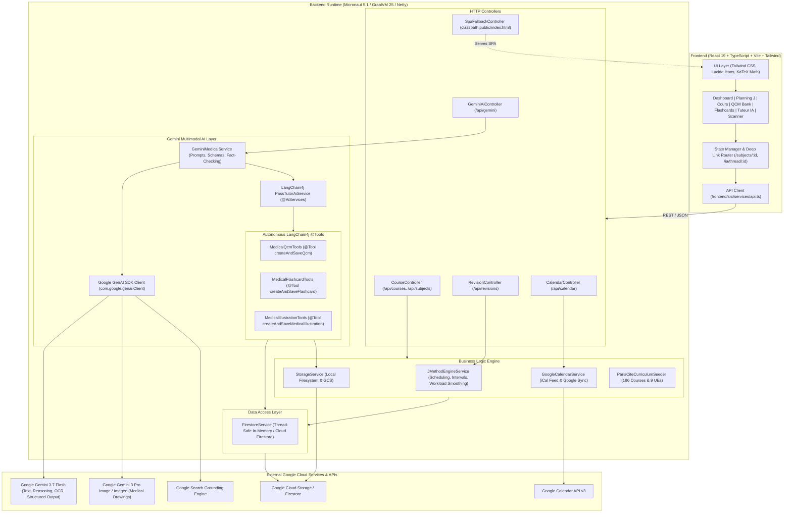
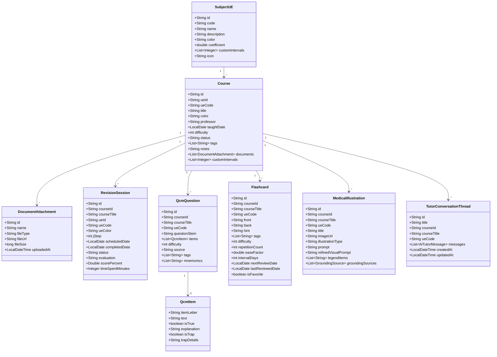

# AGENTS.md — MedJ Codebase Architecture, Technical & Infrastructure Reference

> **Document Version**: 2.0.0  
> **Last Updated**: 2026-08-20  
> **Target Audience**: AI Agents (Antigravity, coding assistants) and Software Engineers working on the **MedJ** repository.

---

## 1. Executive Summary & Core Mission

**MedJ** (*Méthode des J & IA Gemini pour Étudiants en Médecine*) is a high-performance, full-stack educational web application and Progressive Web App (PWA) engineered specifically for French medical students preparing for the hyper-competitive **PASS** (*Parcours Accès Santé Spécifique*) and **LAS** (*Licence Accès Santé*) university examinations.

### Key Value Propositions
1. **Automated Spaced Repetition (Méthode des J)**:
   - Configurable repetition cycles ($J_0, J_1, J_3, J_7, J_{14}, J_{30}, J_{60}$) calculated dynamically from initial course lecture dates.
   - **Pedagogical Workload Smoothing (*Lissage de Charge*)**: Automatic rebalancing of overloaded days into adjacent lighter days, prioritizing adjustments to late-stage consolidation cycles ($J_{30}, J_{60}$) while strictly anchoring critical early memory encoding ($J_0, J_1, J_3$).
   - Granular scheduling adjustments: interactive HTML5 Drag & Drop planning, bulk shifting per Teaching Unit (*Unité d'Enseignement - UE*), and $+1j / -1j / +3j / +7j$ quick buttons.

2. **Comprehensive Flashcards System with SM-2 Spaced Repetition**:
   - Active recall question-answer cards with LaTeX math and chemical formulas.
   - Confidence-based self-rating (`AGAIN`, `HARD`, `GOOD`, `EASY`) computing dynamic interval days, repetition streaks, and ease factors.
   - **LLM-as-Judge Verification**: Automated fact-checking of flashcards against Google Search Grounding with side-by-side correction proposals.
   - Printable double-sided PASS flashcard sheets (*Planches de fiches imprimables format A4*).

3. **Multimodal Google Gemini AI Engine**:
   - **Official PASS QCM Generator**: Strict 5-proposition format ($A, B, C, D, E$) with independent True/False grading, official scoring heuristics, trap detection (*inversion droite/gauche*, *distal/proximal*, *fausses valeurs numériques*), and mnemonics.
   - **Handwritten Notes & Summary Scanner (*Fiches de Révision*)**: Multimodal OCR and structured extraction of markdown summaries, anatomical terms, key figures, and exam traps from photos or PDFs.
   - **Annale / Exam OCR Scanner**: Converts photos or scanned documents of past exam papers into interactive digital quiz items.
   - **Grounded AI Medical Tutor**: Conversational PASS tutor using LangChain4j and Google GenAI SDK with autonomous tool-calling (`createAndSaveQcm`, `createAndSaveFlashcard`, `createAndSaveMedicalIllustration`), conversation thread summarization, and real-time **Google Search Grounding** with clickable source citations.
   - **Medical Illustration & Fill-in-the-Blank Generator**: High-fidelity anatomical diagrams and numbered printable worksheets (*planches d'entraînement à trous*) with French medical nomenclature (*Terminologia Anatomica*), automated multimodal fact-checking, and interactive regeneration.

4. **Official Paris Cité Curriculum & Zero-Data Mode**:
   - Built-in curriculum for **Université Paris Cité** covering 9 UEs (UE1 to UE7, Spécialités & Mineure) and 186 foundational medical courses.
   - Configurable clean startup (`medj.seed-sample-data: false`) allowing users to start with an empty database or seed demo data with 1 click.

5. **Google Calendar & iCal Synchronization**:
   - Direct export and live calendar subscription via standard iCalendar feed (`/api/calendar/feed.ics`).
   - OAuth2 synchronization to a dedicated Google Calendar (*"MedJ - Révisions PASS"*).

---

## 2. System Architecture & Component Diagram



---

## 3. Technology Stack Breakdown

| Tier | Component | Technology & Version | Architectural Justification |
| :--- | :--- | :--- | :--- |
| **Runtime** | JVM Engine | **GraalVM CE 25 (Java 25)** | Cutting-edge execution performance, virtual threads, low-latency garbage collection, and native image compilation readiness. |
| **Backend** | Framework | **Micronaut Framework 5.1.2** | Ultra-fast startup (<500ms), low memory footprint (<80MB), Netty non-blocking I/O, compile-time dependency injection and reflection-free serde. |
| **Serialization** | JSON Parser | **Micronaut Serde Jackson 5.1.2** | Ahead-of-time code generation for `@Serdeable` DTOs, avoiding Java runtime reflection. |
| **AI SDK (Direct)** | Structured SDK | `com.google.genai:google-genai:1.67.0` | Official Google GenAI Java SDK supporting strict JSON Schema structured output and multimodal uploads. |
| **AI (Agentic)** | Tool Calling | **LangChain4j 1.19.0 / 1.19.0-beta29** | High-level `@AiServices` abstraction providing autonomous tool execution (`MedicalQcmTools`, `MedicalFlashcardTools`, `MedicalIllustrationTools`) and Google Search Grounding. |
| **PDF Processing** | Document Parser | **Apache PDFBox 3.0.8** | Extracting textual and graphical elements from uploaded medical handouts and past exams. |
| **Cloud Services** | Persistence & Sync | **Cloud Firestore, Google Cloud Storage, Google Calendar API** | Serverless document database, object hosting, and bidirectional calendar synchronization. |
| **Frontend** | UI Library | **React 19.0.0** | Declarative component UI utilizing React 19 hooks and concurrent rendering. |
| **Build & Dev** | Bundler | **Vite 6.1.0 & TypeScript 5.7.3** | Near-instant HMR, strict type safety matching backend Serde records, and optimized Rollup production bundling. |
| **Styling** | CSS Engine | **Tailwind CSS 3.4.17 + PostCSS** | Utility-first responsive design supporting full dark-mode palette and high-contrast medical ergonomics. |
| **Math Engine** | LaTeX Renderer | `KaTeX`, `react-markdown`, `remark-math`, `rehype-katex` | Client-side rendering of biophysics, pharmacokinetics, and chemistry equations. |
| **Icons** | Iconography | **Lucide React 0.469.0** | Lightweight tree-shakeable icon set. |
| **Build Orchestration** | Build Tool | **Gradle 8.x / 9.x (Groovy DSL)** + `gradle-node-plugin` | Hermetic, zero-dependency reproducible build downloading isolated Node.js 22 & npm 10. |

---

## 4. Architectural Patterns & Deep Technical Decisions

### 1. Dual AI Engine Strategy (Direct SDK + Agentic LangChain4j)
- **Direct Google GenAI SDK (`com.google.genai.Client`)**:
  - Utilized for deterministic, schema-constrained tasks: QCM generation, Flashcard generation, OCR document scans, and LLM-as-Judge fact-checking.
  - Implements strict `com.google.genai.types.Schema` definitions ensuring 100% valid JSON conforming to medical exam formats without parsing hallucinations.
- **LangChain4j (`PassTutorAiService`)**:
  - Powers the conversational medical tutor.
  - Injected with `@Tool` annotated components (`MedicalQcmTools`, `MedicalFlashcardTools`, `MedicalIllustrationTools`).
  - Allows Gemini 3.7 Flash to autonomously persist QCMs, flashcards, and medical illustrations into the user's database while conversing with the student.

### 2. LLM-as-Judge Medical Fact-Checking Pipeline
- Implemented for **QCMs**, **Flashcards**, and **Medical Illustrations**.
- Sends the item along with real-time Google Search Grounding to Gemini 3.7 Flash.
- Returns a structured assessment:
  - **Verdict**: `EXACT`, `CORRECTION_PROPOSEE`, or `INVALIDE`.
  - **Accuracy Score**: Integer rating from 0 to 100.
  - **Identified Traps / Anomalies**: Medical inaccuracies, outdated nomenclature, or numerical errors.
  - **Corrected Payload**: Drop-in corrected QCM or Flashcard ready for 1-click user adoption.
  - **Web Grounding Citations**: Authoritative references (HAS, ANSM, Collèges Médicaux, PubMed).

### 3. Automatic Conversation Summarization
- New conversation threads with the AI Tutor automatically generate a concise, professional title (4 to 7 words in French medical terminology) via Gemini 3.7 Flash.
- A robust regex-based heuristic cleaner strips conversational greetings (*"Bonjour"*, *"Peux-tu m'expliquer en détail..."*, *"Crée-moi un QCM sur..."*) as a zero-latency fallback.

### 4. SM-2 & Spaced Repetition Workload Smoothing Algorithm (*Lissage de Charge*)
- **J-Method Cycles**: Computes target dates for $J_0, J_1, J_3, J_7, J_{14}, J_{30}, J_{60}$.
- **Workload Smoothing**: When a day's scheduled sessions exceed `dailyOverloadThreshold` (default: 6 sessions/day):
  - Sessions with higher $J$-steps ($J_{30}, J_{60}$) are shifted to the nearest under-capacity future date.
  - Early-stage consolidation repetitions ($J_0, J_1, J_3$) remain strictly anchored to protect initial memory encoding.
- **Flashcards SM-2**: Each card maintains `easeFactor` (initial: 2.5), `intervalDays`, `repetitionCount`, and rating history (`AGAIN` $\rightarrow$ reset to 1 day; `HARD` $\rightarrow \times 1.2$; `GOOD` $\rightarrow \times \text{EF}$; `EASY` $\rightarrow \times \text{EF} \times 1.3$).

### 5. Resilient Offline-First Architecture
- MedJ executes flawlessly with zero external credentials or without `GEMINI_API_KEY`.
- Fallbacks include:
  - Synthetic offline QCM and Flashcard generators covering Anatomy, Biochemistry, Biophysics, Pharmacology, and Histology.
  - Algorithmic vector SVG generators for anatomical diagrams and printable fill-in-the-blank worksheets.
  - Thread-safe in-memory database (`ConcurrentHashMap`) in `FirestoreService`.

### 6. Unified Single-Artifact Web Packaging
- Gradle executes `npm run build` via `buildFrontend`.
- `processResources` bundles `frontend/dist/` into `classpath:public/`.
- `SpaFallbackController` transparently serves `index.html` for all non-API HTML5 routes (`/today`, `/planning`, `/subjects/*`, `/qcms/*`, `/flashcards/*`, `/ia/*`).

---

## 5. Repository Structure & Map

```
medj/
├── AGENTS.md                                # This document (Comprehensive system guide)
├── README.md                                # Developer quickstart & feature overview
├── build.gradle                             # Micronaut & Gradle build script + Node packaging
├── settings.gradle                          # Gradle settings & plugin repositories
├── gradle.properties                        # JVM arguments & Gradle caching options
├── gradlew / gradlew.bat                    # Gradle wrapper executables
├── uploads/                                 # Local storage directory for files, PDFs & scans
├── src/
│   ├── main/
│   │   ├── java/fr/medj/
│   │   │   ├── Application.java             # Micronaut Main Entrypoint
│   │   │   ├── controller/
│   │   │   │   ├── CalendarController.java   # Calendar sync & iCal (.ics) feed endpoints
│   │   │   │   ├── CourseController.java     # Courses, Subject UEs, Documents & Sample Data
│   │   │   │   ├── GeminiAiController.java   # QCMs, Flashcards, Tutor chat, Scans, Illustrations
│   │   │   │   ├── RevisionController.java   # J-Method sessions, completion & workload smoothing
│   │   │   │   └── SpaFallbackController.java# SPA HTML5 fallback router
│   │   │   ├── model/
│   │   │   │   ├── AiTutorMessage.java       # Tutor messages with tool-created artifacts & grounding
│   │   │   │   ├── Course.java               # Medical course definition with custom intervals & docs
│   │   │   │   ├── DocumentAttachment.java   # Attached PDF / handout document model
│   │   │   │   ├── Flashcard.java            # Spaced repetition flashcard with SM-2 metrics
│   │   │   │   ├── FlashcardAttempt.java     # Student flashcard review session history
│   │   │   │   ├── FlashcardVerification.java# LLM-as-Judge fact-checking report for flashcards
│   │   │   │   ├── GroundingSource.java      # Google Search Grounding citation (title, uri, domain)
│   │   │   │   ├── HandwrittenScanResult.java# OCR markdown, anatomical terms, traps & numbers
│   │   │   │   ├── IllustrationVerification.java # Fact-checking report for generated drawings
│   │   │   │   ├── ItemVerification.java     # Individual QCM item (A-E) verification outcome
│   │   │   │   ├── JScheduleConfig.java      # Spaced repetition configuration & thresholds
│   │   │   │   ├── MedicalIllustration.java  # Anatomical diagram & fill-in-the-blank model
│   │   │   │   ├── QcmAttempt.java           # Student quiz attempt & scoring history
│   │   │   │   ├── QcmItem.java              # Single QCM proposition (A-E, True/False, Trap)
│   │   │   │   ├── QcmQuestion.java          # 5-item PASS question stem, mnemonics & tags
│   │   │   │   ├── QcmVerificationResult.java# Full QCM fact-checking result with corrected QCM
│   │   │   │   ├── RevisionSession.java      # Scheduled J-session (J0..J60) with status & rating
│   │   │   │   ├── SubjectUE.java            # Medical Teaching Unit (UE1 to UE7, Mineure)
│   │   │   │   └── TutorConversationThread.java # Conversational thread history
│   │   │   └── service/
│   │   │       ├── FirestoreService.java     # Primary data repository (Memory / Firestore)
│   │   │       ├── GeminiMedicalService.java # Core Gemini SDK client, prompts, OCR & verification
│   │   │       ├── GoogleCalendarService.java# Google Calendar API & iCalendar generator
│   │   │       ├── JMethodEngineService.java # Spaced repetition calculator & workload smoothing
│   │   │       ├── MedicalFlashcardTools.java# LangChain4j @Tool for Flashcard persistence
│   │   │       ├── MedicalIllustrationTools.java # LangChain4j @Tool for medical diagrams
│   │   │       ├── MedicalQcmTools.java      # LangChain4j @Tool for QCM persistence
│   │   │       ├── ParisCiteCurriculumSeeder.java # 186 Courses, QCMs & Flashcards PASS JSON Loader
│   │   │       ├── PassTutorAiService.java   # LangChain4j @AiServices interface & system prompt
│   │   │       └── StorageService.java       # Local filesystem & GCS file manager
│   │   └── resources/
│   │       ├── application.yml              # Server, Security, Gemini & GCP configuration
│   │       ├── logback.xml                  # Logging configuration
│   │       └── sample-data/
│   │           └── paris-cite-curriculum.json # Externalized JSON PASS dataset (186 courses, QCMs, Flashcards, 9 UEs)
│   └── test/
│       ├── java/fr/medj/
│       │   ├── CourseDocumentScanAttachmentTest.java # PDF upload & course document attachment tests
│       │   ├── FlashcardCrudTest.java       # Flashcard creation, review ratings & filtering tests
│       │   ├── FlashcardVerificationTest.java # Flashcard LLM-as-Judge verification tests
│       │   ├── GroundingTutorTest.java      # Google Search Grounding citation tests
│       │   ├── JMethodEngineServiceTest.java# Workload smoothing & session generation tests
│       │   ├── MedicalQcmToolsTest.java     # LangChain4j @Tool execution & persistence tests
│       │   ├── ParisCiteCurriculumSeederTest.java # 186 courses & 9 UEs seeder tests
│       │   ├── QcmCrudTest.java             # QCM creation, filtering & retrieval tests
│       │   ├── QcmVerificationTest.java     # QCM fact-checking & correction pipeline tests
│       │   ├── SubjectCrudTest.java         # Subject UE creation & validation tests
│       │   └── TutorTitleSummarizationTest.java # AI Tutor thread title summarization tests
│       └── resources/
│           └── application-test.yml         # Test environment configuration
└── frontend/
    ├── package.json                         # Frontend dependencies & npm scripts
    ├── tsconfig.json / vite.config.ts       # TypeScript & Vite bundler settings (API proxy on :8080)
    ├── tailwind.config.js / postcss.config.js # Tailwind CSS configuration
    ├── index.html                           # HTML5 host page
    └── src/
        ├── App.tsx                          # Root React component, router & state manager
        ├── main.tsx                         # React 19 DOM entrypoint
        ├── types.ts                         # TypeScript domain models matching backend Serde DTOs
        ├── index.css                        # Tailwind directives & custom CSS animations
        ├── context/ThemeContext.tsx         # Dark/Light theme state
        ├── services/api.ts                  # Typed Axios/Fetch wrapper for all backend endpoints
        ├── utils/
        │   ├── dateUtils.ts                 # Date formatting & timezone-safe helpers
        │   └── printWorksheet.ts            # Print stylesheet generator for blank worksheets
        ├── hooks/useEscapeKey.ts            # Keyboard shortcut helper for closing modals
        └── components/
            ├── Navbar.tsx                   # Top navigation with sync button & badge count
            ├── DashboardView.tsx            # Today's due revisions, overdue alerts & stats
            ├── JCalendarView.tsx            # Interactive monthly/weekly planning & drag-drop
            ├── CourseListView.tsx           # Course index grouped by UE with filter chips
            ├── CourseDetailView.tsx         # Full course view with sessions, QCMs, flashcards & threads
            ├── CourseCombobox.tsx           # Searchable autocomplete combobox for medical courses
            ├── QcmBankView.tsx              # Searchable QCM database with verification badges
            ├── QcmTrainerModal.tsx          # Interactive quiz modal with PASS grading scale
            ├── QcmVerificationModal.tsx     # Fact-checking review modal with 1-click apply
            ├── FlashcardBankView.tsx        # Searchable Flashcard bank with study mode
            ├── FlashcardPlayerModal.tsx     # Interactive 3D flip card study session modal
            ├── FlashcardVerificationModal.tsx # Flashcard fact-checking review modal
            ├── PrintFlashcardsModal.tsx     # Double-sided printable flashcards layout modal
            ├── EditFlashcardModal.tsx       # Custom flashcard editor with LaTeX preview
            ├── AiTutorChat.tsx              # Interactive tutor chat with tool artifacts
            ├── GeminiScannerModal.tsx       # Multimodal scanner for fiches & exam papers
            ├── MedicalIllustrationModal.tsx # Diagram viewer with maskable legend & zoom
            ├── NewIllustrationModal.tsx     # Direct diagram prompt generation modal
            ├── NewCourseModal.tsx           # New course creation modal with J0 scheduling & on-the-fly UE
            ├── EditQcmModal.tsx             # QCM editor with 5-item A-E validator
            ├── EditSubjectModal.tsx         # Subject UE customization modal
            ├── EditCourseNotesModal.tsx     # Course markdown summary & notes editor
            ├── AddRevisionModal.tsx         # Manual revision session scheduler
            ├── SettingsModal.tsx            # Spaced repetition intervals & threshold config
            ├── ProgressionChart.tsx         # Visual progress tracking
            ├── MarkdownRenderer.tsx         # KaTeX math & Markdown renderer
            └── FullscreenImageViewer.tsx   # Zoomable high-res medical image lightbox
```

---

## 6. Domain Data Models (UML Class Diagram)



---

## 7. REST API Complete Reference

### 7.1 Subjects, Courses & Documents (`/api`)
| Method | Path | Request Body | Description |
| :--- | :--- | :--- | :--- |
| `GET` | `/api/subjects` | — | Retrieves all medical Teaching Units (UE1 to UE7 + Mineures). |
| `POST` | `/api/subjects` | `SubjectUE` | Creates a new UE. |
| `PUT` | `/api/subjects/{id}` | `SubjectUE` | Updates an existing UE and cascades color changes to courses & sessions. |
| `DELETE` | `/api/subjects/{id}` | — | Deletes a UE. |
| `GET` | `/api/courses` | Query: `ueId` (opt) | Retrieves all courses, optionally filtered by UE. |
| `GET` | `/api/courses/{id}` | — | Retrieves a single course with attached documents. |
| `POST` | `/api/courses` | `Course` | Creates a course and automatically generates J-Method sessions ($J_0..J_{60}$). |
| `PUT` | `/api/courses/{id}` | `Course` | Updates course details and cascades color updates. |
| `DELETE` | `/api/courses/{id}` | — | Deletes a course and all associated revision sessions, QCMs, and cards. |
| `POST` | `/api/courses/{id}/documents/upload` | Multipart (`file`) | Uploads and attaches a PDF or image handout directly to a course. |
| `DELETE` | `/api/courses/{id}/documents/{docId}`| — | Deletes a document attachment from a course. |

### 7.2 Spaced Repetition & Workload (`/api/revisions`)
| Method | Path | Request Body | Description |
| :--- | :--- | :--- | :--- |
| `GET` | `/api/revisions` | Query: `date`, `courseId`, `ueId`, `status` | Filters revision sessions by multiple criteria. |
| `GET` | `/api/revisions/today` | — | Retrieves today's summary (due today, overdue, completed today). |
| `GET` | `/api/revisions/workload`| Query: `start`, `end` | Workload distribution map and list of overloaded dates. |
| `POST` | `/api/revisions/{id}/complete` | `CompleteSessionRequest` | Marks session as completed with grade and time spent. |
| `POST` | `/api/revisions/{id}/uncomplete` | — | Resets a session back to pending/overdue. |
| `POST` | `/api/revisions/{id}/shift` | `ShiftSessionRequest` (`daysToAdd`) | Shifts a single session by $+N$ / $-N$ days. |
| `POST` | `/api/revisions/shift-subject` | `ShiftSubjectRequest` (`ueId`, `daysToAdd`) | Bulk shifts all upcoming sessions for an entire UE. |
| `POST` | `/api/revisions/smooth-workload` | `SmoothWorkloadRequest` (`dailyLimit`) | Executes intelligent workload smoothing algorithm. |
| `POST` | `/api/revisions` | `CreateRevisionRequest` | Creates a custom revision session for a course. |
| `DELETE` | `/api/revisions/{id}` | — | Deletes an individual revision session. |

### 7.3 Gemini AI, Tutor, QCMs, Flashcards & Scans (`/api/gemini`)
| Method | Path | Request Body | Description |
| :--- | :--- | :--- | :--- |
| `POST` | `/api/gemini/generate-qcm` | `GenerateQcmRequest` | Generates 5-item PASS QCMs with JSON Schema. |
| `POST` | `/api/gemini/scan-annale` | Multipart (`file`) | Multimodal OCR of exam papers/PDFs into interactive QCM questions. |
| `POST` | `/api/gemini/scan-handwritten` | Multipart (`file`) | Multimodal extraction of handwritten fiches into structured markdown, terms, and traps. |
| `POST` | `/api/gemini/tutor` | `AskTutorRequest` | Conversational PASS tutor with LangChain4j `@Tool` calls, title summarization, and Google Search Grounding. |
| `GET` | `/api/gemini/tutor/threads` | Query: `courseId` (opt) | Lists all or course-specific tutor conversation threads. |
| `POST` | `/api/gemini/tutor/threads` | `CreateThreadRequest` | Creates a new tutor conversation thread. |
| `DELETE` | `/api/gemini/tutor/threads/{id}` | — | Deletes a conversation thread. |
| `GET` | `/api/gemini/qcms` | Query: `courseId` (opt) | Lists persisted QCMs. |
| `POST` | `/api/gemini/qcms` | `QcmQuestion` | Saves a custom or AI-generated QCM. |
| `PUT` | `/api/gemini/qcms/{id}` | `QcmQuestion` | Updates a QCM. |
| `DELETE` | `/api/gemini/qcms/{id}` | — | Deletes a QCM. |
| `POST` | `/api/gemini/qcms/{id}/verify` | — | Audits and fact-checks a QCM against Google Search Grounding. |
| `POST` | `/api/gemini/verify-qcm` | `QcmQuestion` | Fact-checks an arbitrary QCM payload. |
| `POST` | `/api/gemini/qcm-attempts` | `QcmAttempt` | Records student score and stats for an exam session. |
| `GET` | `/api/gemini/qcm-attempts` | Query: `courseId` (opt) | Retrieves attempt history. |
| `GET` | `/api/gemini/flashcards` | Query: `courseId`, `ueId`, `favorite` (opt) | Lists active recall flashcards. |
| `POST` | `/api/gemini/flashcards` | `Flashcard` | Creates a new flashcard. |
| `PUT` | `/api/gemini/flashcards/{id}` | `Flashcard` | Updates a flashcard. |
| `DELETE` | `/api/gemini/flashcards/{id}` | — | Deletes a flashcard. |
| `POST` | `/api/gemini/flashcards/{id}/favorite` | — | Toggles star favorite status. |
| `POST` | `/api/gemini/flashcards/{id}/review` | `ReviewFlashcardRequest` | Records spaced repetition review rating (`AGAIN`, `HARD`, `GOOD`, `EASY`) and computes SM-2 metrics. |
| `POST` | `/api/gemini/flashcards/{id}/verify` | — | Fact-checks a flashcard with LLM-as-Judge & Google Search Grounding. |
| `POST` | `/api/gemini/verify-flashcard` | `Flashcard` | Fact-checks an arbitrary flashcard payload. |
| `POST` | `/api/gemini/illustrations/generate` | `GenerateIllustrationRequest` | Generates anatomical diagram or printable fill-in-the-blank drawing via `gemini-3-pro-image`. |
| `POST` | `/api/gemini/illustrations/{id}/regenerate` | `RegenerateIllustrationRequest` | Re-generates illustration with prompt adjustments. |
| `POST` | `/api/gemini/illustrations/{id}/verify` | — | Multimodal visual inspection & fact-checking of generated illustrations. |
| `GET` | `/api/gemini/illustrations` | Query: `courseId` (opt) | Lists generated illustrations. |
| `DELETE` | `/api/gemini/illustrations/{id}` | — | Deletes an illustration. |

### 7.4 Calendar, Storage & Sample Data (`/api`)
| Method | Path | Request Body | Description |
| :--- | :--- | :--- | :--- |
| `POST` | `/api/calendar/sync` | `SyncCalendarRequest` | Synchronizes pending revisions to Google Calendar. |
| `GET` | `/api/calendar/feed.ics` | — | Returns standard iCalendar (`.ics`) subscription stream. |
| `GET` | `/api/config` | — | Retrieves global J-Method and calendar settings. |
| `PUT` | `/api/config` | `JScheduleConfig` | Updates settings (intervals, daily limits, presets). |
| `GET` | `/api/sample-data/status` | — | Returns data counts & whether demo data is active. |
| `POST` | `/api/sample-data/seed` | — | Dynamically seeds Paris Cité curriculum (186 courses, QCMs, flashcards). |
| `POST` | `/api/sample-data/clear` | — | Clears all courses, revisions, QCMs, and flashcards. |
| `POST` | `/api/storage/upload` | Multipart (`file`) | Uploads a file (PDF, image) to local storage or GCS. |
| `GET` | `/api/storage/{filename}` | — | Streams stored file bytes with appropriate content-type. |

---

## 8. Build, Test, and Execution Instructions

### Prerequisites
- **Java / GraalVM**: **GraalVM 25 (Java 25)** (e.g., via SDKMAN: `25.0.2-graalce`).
  ```bash
  sdk use java 25.0.2-graalce
  export JAVA_HOME=~/.sdkman/candidates/java/25.0.2-graalce
  ```
- **Framework**: **Micronaut 5.1.2** configured with reflection-free Serde.
- **Node.js / npm**: Automatically provisioned by Gradle (`node-gradle-plugin`), or isolated Node 22.

### Development Commands

#### 1. Full-Stack Development Mode (Single Command)
Compiles React into classpath resources and starts Netty server on `http://localhost:8080`:
```bash
./gradlew run
```

#### 2. Fast Frontend Hot-Reloading Mode (Vite Dev Server)
When iterating heavily on React components:
```bash
# Terminal 1: Backend API on :8080
./gradlew run

# Terminal 2: Vite Dev Server on :5173 with proxy to :8080
cd frontend
npm install
npm run dev
```

#### 3. Running Automated Tests
```bash
./gradlew test
```

#### 4. Production Build (Fat JAR)
Generates an optimized standalone executable JAR:
```bash
./gradlew build
# Output: build/libs/medj-0.1.0-all.jar
java -jar build/libs/medj-0.1.0-all.jar
```

---

## 9. Infrastructure & Deployment Architecture

### 1. Cloud Run & Firebase Production Architecture
MedJ is fully containerizable and optimized for **Google Cloud Run** and **Firebase Hosting**:
- **Backend on Cloud Run (`medj-backend`)**: Deployed from pre-packaged layers (`prepareCloudRun`) using `--no-build` on the official **Java 25** runtime base image (`europe-west1-docker.pkg.dev/serverless-runtimes/google-24-full/runtimes/java25`).
- **Frontend on Firebase Hosting (`medj.web.app`)**: Serves the React 19 SPA with native rewrite proxy `/api/**` routing to Cloud Run.
- **Security & Allowlist**: `FirebaseAuthFilter` verifies Google JWT ID tokens and restricts access to allowed accounts (`glaforge@gmail.com`, `marionlaforge4@gmail.com`). Public exemptions for `/api/calendar/feed.ics` and `/api/storage/**`.
- **Stateless Cloud Persistence**: Cloud Firestore in Native mode (`europe-west1`) and Google Cloud Storage bucket (`gs://medj-505807-assets`).

```bash
# Build layers and deploy to Cloud Run (Java 25, no-build)
./gradlew prepareCloudRun
gcloud beta run deploy medj-backend \
  --source build/cloud-run \
  --no-build \
  --base-image=europe-west1-docker.pkg.dev/serverless-runtimes/google-24-full/runtimes/java25 \
  --command="java" \
  --args="-cp,app/*:libs/*:resources,fr.medj.Application" \
  --region=europe-west1 \
  --project=medj-505807 \
  --set-secrets="GEMINI_API_KEY=GEMINI_API_KEY:latest" \
  --set-env-vars="^#^GCP_PROJECT_ID=medj-505807#GCS_BUCKET=medj-505807-assets#MEDJ_SEED_SAMPLE_DATA=false#MEDJ_ALLOWED_EMAILS=glaforge@gmail.com,marionlaforge4@gmail.com" \
  --allow-unauthenticated
```

### 2. Environment Variables & Secret Configuration
Configure the following runtime environment variables:

| Variable | Description | Default | Required for |
| :--- | :--- | :--- | :--- |
| `GEMINI_API_KEY` | Google Gemini API Key (Secret Manager) | — | Live AI generation, OCR, Tuteur & Fact-checking |
| `GEMINI_MODEL` | Primary text & reasoning model | `gemini-3.7-flash` | QCMs, Flashcards, Tutor & OCR |
| `GEMINI_IMAGE_MODEL`| Image generation model | `gemini-3-pro-image`| Anatomical illustrations & drawings |
| `GCP_PROJECT_ID` | Google Cloud Project ID | `medj-505807` | Cloud Firestore & GCS persistence |
| `GCS_BUCKET` | Cloud Storage assets bucket | `medj-505807-assets` | PDFs, scans, generated images |
| `MEDJ_ALLOWED_EMAILS`| Whitelisted user email list | `glaforge@gmail.com,...` | Access control & student auth |
| `MEDJ_SEED_SAMPLE_DATA`| Seed demo curriculum on startup | `false` | Zero-data vs Demo mode |

### 3. Production Data Safety & Zero Data Loss Policy
> [!CAUTION]
> **CRITICAL RULE FOR ALL AI AGENTS & DEVELOPERS**:
> The production database (**Cloud Firestore**) contains **real, active student data** (Teaching Units / UEs, courses, custom notes, spaced repetition revision history, scanned documents, flashcards, and QCM attempts).
>
> 1. **NEVER OVERWRITE OR WIPE PRODUCTION DATA**:
>    - Never execute data clearing commands (`scripts/clear-production-data.sh` or `/api/sample-data/clear`) against production.
>    - `MEDJ_SEED_SAMPLE_DATA` MUST always be set to `false` in production environments (`deploy-production.sh` and Cloud Run configuration) so sample data is never seeded over real student data.
>
> 2. **NON-DESTRUCTIVE SCHEMA MIGRATIONS**:
>    - Any evolution of domain models (adding fields, changing primitive types, restructuring relationships) must be **strictly backward- and forward-compatible**.
>    - Deserialization methods in `FirestoreService` (`docToSubject`, `docToCourse`, `docToRevision`, `docToQcm`, `docToFlashcard`, etc.) must always support legacy field shapes, provide sensible default values, and use type-resilient parsers (e.g., `instanceof Number` for numeric conversions like `int` to `double`).
>    - Never perform "drop-and-recreate" migrations. Schema updates must happen incrementally and seamlessly upon document read/write.

---

## 10. AI Agent Development Rules & Conventions

When modifying, extending, or refactoring the MedJ codebase, all AI agents and developers **must adhere** to the following principles:

### 1. French Medical Terminology Standards
- Prompts, UI strings, medical descriptions, and labels must use standard French medical terminology (*Terminologia Anatomica française*, nomenclature officielle des Collèges d'Enseignants).
- Always maintain exact spelling with accents (*ex: Récepteur bêta-1 adrénergique, Sillon bicipital, Fente huméro-tricipitale*).

### 2. French PASS QCM Format Compliance
- All generated or modified QCMs must strictly adhere to the 5-item format ($A, B, C, D, E$).
- Each item must be independently evaluable as True (`true`) or False (`false`).
- Explanations must clearly articulate why an item is true or false and identify the specific trap type if `isTrap` is true.

### 3. Serialization & DTO Integrity
- Any new model class used in controller requests or responses must be annotated with `@io.micronaut.serde.annotation.Serdeable`.
- Avoid Java runtime reflection; prefer record classes or immutable POJOs with constructor mapping.
- Maintain bidirectional synchronization between Java backend models (`fr.medj.model.*`) and TypeScript interface definitions (`frontend/src/types.ts`).

### 4. Strict Production Data Preservation & Non-Destructive Migrations
- **Zero Data Overwrite**: Never wipe, reset, or overwrite production data during deployments or code updates. Real student data is actively stored in production Firestore.
- **Backward-Compatible Deserializers**: All Firestore deserializers (`docToSubject`, `docToCourse`, etc.) must tolerate missing fields, legacy types, and nulls with safe fallback defaults.
- **Safe Schema Evolution**: When altering fields (such as converting `int coefficient` to `double coefficient`), write robust deserializers that parse both legacy formats (`Long`) and new formats (`Double`) seamlessly.

### 5. Thread-Safety & Resilience in Services
- In-memory collections in `FirestoreService`, `MedicalQcmTools`, and `MedicalFlashcardTools` must remain thread-safe (`ConcurrentHashMap`, `Collections.synchronizedList`).
- Always implement realistic fallback data or graceful error handling in AI service methods so the application remains operable without API keys.

### 6. UI/UX Aesthetics, Dark Mode & High-Contrast Typography
- Maintain the dark-mode aesthetic with high contrast (`slate-950` backgrounds, `sky-500` accents, `emerald-500` validation greens, `rose-500` warnings).
- For colored backgrounds (such as active blue headers `bg-sky-600`), ensure all text, day labels, badges, and icons remain pure white (`#ffffff`) in both Light and Dark modes.
- Ensure all interactive modals support keyboard dismissal via `Escape` key (`useEscapeKey`).
- Preserve KaTeX mathematical formula rendering for pharmacokinetics and biophysics equations.
