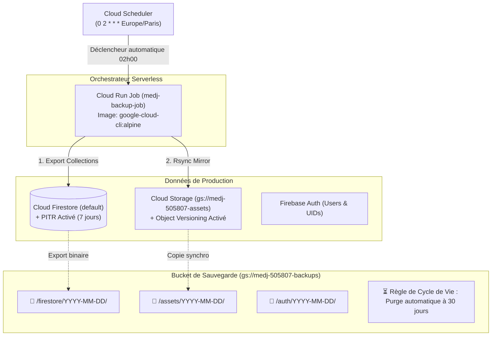

# MedJ — Plan de Sauvegarde & Guide de Restauration (Disaster Recovery & Rollback)

Ce document décrit le fonctionnement du système de sauvegarde automatisé de **MedJ** sur Google Cloud, les politiques de rétention, ainsi que les procédures de restauration et de retour arrière (*rollback*) en cas de perte de données ou de fausse manipulation.

---

## 1. Vue d'Ensemble de l'Architecture de Sauvegarde

MedJ implémente une **stratégie de résilience multi-niveaux** :



---

## 2. Périmètre & Fréquence des Sauvegardes

| Ressource | Type de Protection | Fréquence / Déclenchement | Emplacement / Destination | Rétention |
| :--- | :--- | :--- | :--- | :--- |
| **Cloud Firestore** | **Point-in-Time Recovery (PITR)** | En continu (à la seconde près) | Natif Firestore | **7 jours** glissants |
| **Cloud Firestore** | **Backup Schedule Natif** | Quotidien (Automatisé) | Natif Firestore | **14 jours** |
| **Cloud Firestore** | **Export Snapshot Collections** | Toutes les nuits à **02h00** (`Europe/Paris`) | `gs://medj-505807-backups/firestore/YYYY-MM-DD/` | **30 jours** (Lifecycle rule) |
| **Cloud Storage** | **Object Versioning** | En continu à chaque écriture/suppression | `gs://medj-505807-assets` | Versions historiques |
| **Cloud Storage** | **Snapshot Miroir Journalier** | Toutes les nuits à **02h00** (`Europe/Paris`) | `gs://medj-505807-backups/assets/YYYY-MM-DD/` | **30 jours** (Lifecycle rule) |
| **Firebase Auth** | **Export JSON des Comptes** | À la demande / Script manuel | `gs://medj-505807-backups/auth/YYYY-MM-DD/` | **30 jours** |

---

## 3. Déclenchement Manuel d'une Sauvegarde Immédiate

Pour créer un instantané complet avant une mise à jour majeure ou une manipulation sensible :

```bash
./scripts/backup-now.sh
```

Ce script exécute le job Cloud Run `medj-backup-job`, exporte les comptes Firebase Auth et vérifie l'intégrité de l'archive dans `gs://medj-505807-backups/`.

---

## 4. Procédures de Restauration & Rollback

Le script [`scripts/restore-backup.sh`](scripts/restore-backup.sh) fournit tous les outils nécessaires pour restaurer l'application en cas d'erreur.

### 📋 1. Lister les Sauvegardes Disponibles
```bash
./scripts/restore-backup.sh --list
```

---

### 🔄 2. Restauration Complète (Firestore + Assets) à une Date Donnée
Pour revenir à l'état exact de l'application à une date spécifique (ex: `2026-08-20`) :
```bash
./scripts/restore-backup.sh --date 2026-08-20
```

---

### 🗄️ 3. Restauration Sélective (Firestore Uniquement)
Si l'étudiant a supprimé par erreur un cours, des flashcards ou des séances de révision sans impacter les fichiers :
```bash
./scripts/restore-backup.sh --date 2026-08-20 --only-firestore
```

---

### 🖼️ 4. Restauration Sélective (Assets Cloud Storage Uniquement)
Pour restaurer des schémas anatomiques ou polycopiés PDF supprimés :
```bash
./scripts/restore-backup.sh --date 2026-08-20 --only-assets
```

---

### ⏱️ 5. Restauration Point-in-Time (PITR) à la Seconde Près
Si une erreur critique vient de se produire (ex: suppression de données il y a 15 minutes), vous pouvez restaurer la base à un instant $T$ précis :
```bash
./scripts/restore-backup.sh --pitr "2026-08-20T14:45:00Z"
```

---

## 5. Maintenance & Gestion des Coûts

- **Bucket de Backup** : Une règle de cycle de vie GCS (*Lifecycle Rule*) supprime automatiquement tous les objets créés il y a plus de **30 jours** dans `gs://medj-505807-backups`.
- **Ressources Cloud Run** : Le job `medj-backup-job` est exécuté de manière serverless (0 instance en veille, facturation uniquement pendant les ~15 secondes d'exécution nocturne).
- **Surveillance** : Les journaux d'exécution sont consultables dans Google Cloud Logging sous le filtre `resource.type="cloud_run_job" AND resource.labels.job_name="medj-backup-job"`.
