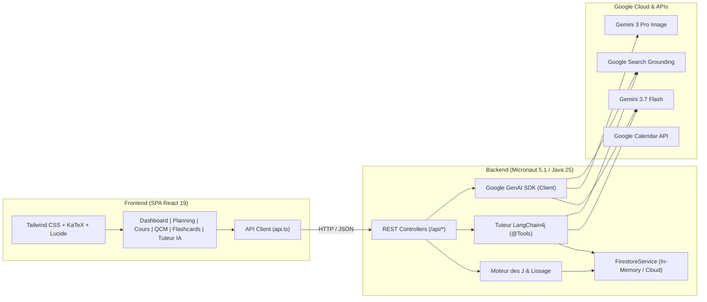

# MedJ — Méthode des J & IA Gemini pour Étudiants en Médecine (PASS / LAS)

<div align="center">

[](https://micronaut.io/)
[](https://www.graalvm.org/)
[](https://react.dev/)
[](https://tailwindcss.com/)
[](https://ai.google.dev/)
[](https://github.com/langchain4j/langchain4j)
[](LICENSE)

**MedJ** est une plateforme web et Progressive Web App (PWA) d'apprentissage haute performance conçue sur-mesure pour les étudiants en santé préparant les concours sélectifs **PASS** (*Parcours Accès Santé Spécifique*) et **LAS** (*Licence Accès Santé*).

Elle associe la puissance cognitive de la **Méthode des J (Répétition Espacée)** et de l'algorithme **SM-2** à l'intelligence artificielle multimodale **Google Gemini** (Gemini 3.7 Flash, Gemini 3 Pro Image) avec **Google Search Grounding** en temps réel.

</div>

---

## 📑 Sommaire
- [1. Présentation & Vision](#1-présentation--vision)
- [2. Fonctionnalités Détaillées](#2-fonctionnalités-détaillées)
  - [📅 Vue Aujourd'hui (Dashboard)](#-vue-aujourdhui-dashboard)
  - [🏛️ Unités d'Enseignement (UE) & Matières](#️-unités-denseignement-ue--matières)
  - [📚 Gestion Complète des Cours](#-gestion-complète-des-cours)
  - [🔄 La Méthode des J & Lissage de Charge](#-la-méthode-des-j--lissage-de-charge)
  - [📆 Planning Interactif (J-Calendar)](#-planning-interactif-j-calendar)
  - [📇 Flashcards & Algorithme SM-2](#-flashcards--algorithme-sm-2)
  - [📝 Banque de QCMs PASS & Entraînement](#-banque-de-qcms-pass--entraînement)
  - [🤖 Tuteur Médical IA Multimodal](#-tuteur-médical-ia-multimodal)
  - [🎨 Schémas Anatomiques & Planches d'Entraînement](#-schémas-anatomiques--planches-dentraînement)
  - [📷 Scanners Multimodaux IA (Notes & Annales)](#-scanners-multimodaux-ia-notes--annales)
  - [⚖️ Vérification LLM-as-Judge & Fact-Checking](#️-vérification-llm-as-judge--fact-checking)
  - [🗓️ Synchronisation Google Calendar & Flux iCal](#️-synchronisation-google-calendar--flux-ical)
  - [🎓 Programme Officiel Paris Cité & Mode Zéro-Donnée](#-programme-officiel-paris-cité--mode-zéro-donnée)
- [3. Architecture & Stack Technique](#3-architecture--stack-technique)
- [4. Installation & Démarrage](#4-installation--démarrage)
- [5. Configuration & Variables d'Environnement](#5-configuration--variables-denvironnement)
- [6. Tests & Déploiement](#6-tests--déploiement)

---

## 1. Présentation & Vision

La première année des études de santé (PASS / LAS) est caractérisée par une densité colossale d'informations (anatomie descriptive, biophysique, pharmacocinétique, biochimie structurale, histologie, sciences humaines) et un format d'évaluation impitoyable basé sur les **QCMs à 5 propositions indépendantes**.

**MedJ** répond aux deux défis majeurs de l'étudiant :
1. **L'Ancrage Mémoriel à Long Terme** : Automatiser le calcul des révisions espacées ($J_0, J_1, J_3, J_7, J_{14}, J_{30}, J_{60}$) avec lissage intelligent des journées de surcharge pour éviter l'épuisement.
2. **L'Assistant Pédagogique Intelligent & Factuel** : Fournir un tuteur médical disponible 24/7 capable de générer des QCMs conformes au concours, de créer des schémas d'entraînement à trous, de scanner des fiches manuscrites et de vérifier chaque réponse contre la littérature médicale officielle (**Google Search Grounding**).

---

## 2. Fonctionnalités Détaillées

### 📅 Vue Aujourd'hui (Dashboard)
- **Objectif Révisions du Jour** : Vue synthétique instantanée de toutes les séances $J$ arrivant à échéance aujourd'hui.
- **Barre de Progression Globale** : Suivi visuel dynamique du pourcentage de révisions validées dans la journée avec animation de célébration (confettis) une fois l'objectif atteint.
- **Validation Interactive & Notation d'Aisance** : Validation d'un clic avec évaluation qualitative (`FACILE`, `MOYEN`, `DIFFICILE`) et enregistrement du temps passé.
- **Alertes de Retard (*Overdue*)** : Mise en évidence immédiate des révisions en retard avec boutons d'action rapide pour rattraper ou replanifier.
- **Bannière d'Initialisation** : En mode sans données, accès direct pour créer son premier cours ou charger en 1 clic le programme officiel d'exemple (186 cours).

### 🏛️ Unités d'Enseignement (UE) & Matières
- **Organisation Modulaire PASS** : Configuration complète des 9 UEs officielles :
  - **UE1** : Chimie & Biochimie structurale
  - **UE2** : Biologie Cellulaire & Histologie
  - **UE3** : Biophysique & Physiologie
  - **UE4** : Biostatistiques & Épidémiologie
  - **UE5** : Anatomie Générale & Descriptive
  - **UE6** : Pharmacologie, ICM & Cycle de Vie du Médicament
  - **UE7** : Santé, Société, Humanité (SSH) & Santé Publique
  - **Spécialités** : Maïeutique, Odontologie, Pharmacie, Kinésithérapie
  - **Mineure Disciplinaire** : Droit, Économie, Sciences, Psychologie
- **Personnalisation Totale** : Couleur thématique, coefficient, code UE, icône Lucide, et définition d'intervalles de répétition spécifiques par matière.
- **Création à la Volée** : Possibilité d'ajouter instantanément une nouvelle UE directement depuis le formulaire de création de cours.

### 📚 Gestion Complète des Cours
- **Fiches Détaillées par Cours** : Informations exhaustives comprenant titre, UE de rattachement, nom de l'enseignant, date de premier cours en amphi ($J_0$), niveau de difficulté (1 à 5 étoiles), statut et tags thématiques.
- **Notes de Cours en Markdown & LaTeX** : Éditeur de synthèse intégré supportant les équations mathématiques et formules pharmacologiques ($V_d$, $Cl$, équation de Michaelis-Menten, pH Henderson-Hasselbalch) rendues avec précision via **KaTeX**.
- **Pièces Jointes & Documents PDF** : Téléversement et consultation intégrée des polycopiés officiels, diaporamas d'amphi et photos de planches de cours (formats PDF, PNG, JPG).
- **Historique des Révisions** : Calendrier des séances passées et futures associées au cours avec scores et évaluations.
- **Conversations Tuteur IA Liées** : Section dédiée listant tous les échanges passés avec le Tuteur IA sur ce cours précis, avec aperçu du dernier message et ouverture directe du thread.
- **Banques Dédiées** : Accès direct aux QCMs, flashcards et schémas rattachés à ce cours spécifique.

### 🔄 La Méthode des J & Lissage de Charge
- **Cycles d'Ancrage Personnalisables** : Calcul automatique des dates cibles dès la saisie de la date du cours ($J_0$ le jour même, $J_1$ à $+1$ jour, $J_3$, $J_7$, $J_{14}$, $J_{30}$, $J_{60}$).
- **Algorithme de Lissage de Charge (*Pedagogical Workload Smoothing*)** :
  - Détection automatique des journées dépassant le seuil critique (ex: $> 6$ séances/jour).
  - Déplacement progressif des séances les plus tardives ($J_{30}, J_{60}$) vers les jours adjacents les moins chargés.
  - **Sanctuarisation des $J_0, J_1, J_3$** : Les répétitions précoces ne sont jamais décalées afin de préserver la phase critique d'encodage mnésique.
- **Décalages Granulaires & en Bloc** :
  - Boutons rapides d'ajustement : $+1\text{ jour}$, $+3\text{ jours}$, $+1\text{ semaine}$, $-1\text{ jour}$.
  - Décalage groupé par matière (*Bulk Shift*) permettant de repousser d'un coup l'ensemble des révisions d'une UE (ex: lors d'une semaine de révision dédiée).

### 📆 Planning Interactif (J-Calendar)
- **Vues Mensuelle & Hebdomadaire** : Navigation fluide avec sélecteur de date, saut au jour d'aujourd'hui, et statistiques de charge quotidienne.
- **Drag & Drop HTML5** : Glisser-déposer interactif d'une séance d'une colonne à une autre pour réorganiser son planning manuellement en quelques secondes.
- **Design Haute Ergonomie & Lisibilité** :
  - Colonne du jour en cours mise en avant avec un fond distinctif et une typographie blanche éclatante.
  - Badges de volume de charge (`0 J`, `3 J`, `8 J`) avec alerte visuelle rouge en cas de surcharge.
  - Bouton rapide `+` pour ajouter une révision manuelle sur n'importe quel jour du calendrier.

### 📇 Flashcards & Algorithme SM-2
- **Répétition Espacée Active Recall** : Fiches recto (question/notion) / verso (réponse/détail) avec indices dépliables et rendu mathématique LaTeX.
- **Lecteur d'Entraînement 3D Immersif** : Modal d'étude avec retournement de carte animé et contrôle clavier intégral (Espace pour retourner, touches 1 à 4 pour évaluer).
- **Algorithme SM-2 Adaptatif** :
  - `AGAIN` (1) : Reset de l'intervalle à 1 jour et réinitialisation de la série.
  - `HARD` (2) : Intervalle $\times 1.2$, diminution du facteur d'aisance (*Ease Factor*).
  - `GOOD` (3) : Progression normale selon le facteur d'aisance actuel ($\text{intervalle} \times \text{EF}$).
  - `EASY` (4) : Progression accélérée ($\text{intervalle} \times \text{EF} \times 1.3$) et augmentation de l'aisance.
- **Système de Favoris (Étoiles)** : Marquage des cartes prioritaires pour des sessions de révision ciblées.
- **Planches Imprimables A4 Recto-Verso** : Générateur de planches de flashcards prêtes à imprimer et découper, optimisées pour la révision papier hors écran.

### 📝 Banque de QCMs PASS & Entraînement
- **Format Officiel du Concours Médical** : 5 propositions indépendantes ($A, B, C, D, E$), chacune notée unitairement en Vrai ou Faux.
- **Barème Officiel PASS** : Calcul automatique des notes au concours (1 pt si 5/5, 0.5 pt si 4/5, 0.2 pt si 3/5, 0 pt sinon).
- **Détection des Pièges d'Examen** : Identification explicite des pièges classiques insérés par les enseignants (*inversion distal/proximal*, *faux chiffres*, *confusion enzyme/coenzyme*).
- **Moyens Mnémotechniques & Corrigés Détaillés** : Explication pas-à-pas pour chaque proposition avec astuces mnémotechniques associées.
- **Historique & Statistiques d'Entraînement** : Suivi des scores moyens, temps passé et taux de réussite par matière.

### 🤖 Tuteur Médical IA Multimodal
- **Assistant Pédagogique PASS** : Propulsé par Google Gemini 3.7 Flash et LangChain4j (`PassTutorAiService`).
- **Outils Agentiques Autonomes (`@Tool`)** : Pendant la discussion, le Tuteur IA peut créer et enregistrer de lui-même des QCMs (`MedicalQcmTools`), des flashcards (`MedicalFlashcardTools`) ou des schémas (`MedicalIllustrationTools`) directement dans la base de l'élève.
- **Google Search Grounding en Temps Réel** : Réponses systématiquement vérifiées auprès des sources médicales officielles (HAS, ANSM, Collèges Médicaux, PubMed) avec **citations cliquables**.
- **Résumé Automatique des Titres** : Génération intelligente d'un titre court et précis (4 à 7 mots) pour chaque fil de discussion via Gemini 3.7 Flash.
- **Navigation Bidirectionnelle Fluide** : Sélecteur de cours contextuel avec bouton direct vers la fiche de cours (`/subjects/:courseId`) et réinitialisation automatique vers le contexte général.

### 🎨 Schémas Anatomiques & Planches d'Entraînement
- **Génération Haute Fidélité** : Création d'illustrations médicales vectorielles et réalistes via `gemini-3-pro-image` / Imagen 3.
- **Mode Planche d'Entraînement à Trous** : Visualiseur interactif permettant de **masquer les légendes numérotées** d'un clic pour tester sa mémoire visuelle en auto-évaluation.
- **Export & Impression A4** : Impression de fiches d'entraînement vierges avec cartouche de réponses numérotées pour s'entraîner au stylo.

### 📷 Scanners Multimodaux IA (Notes & Annales)
- **Scanner de Fiches Manuscrites** : OCR multimodal analysant des photos de prises de notes ou fiches de révision pour en extraire un résumé markdown structuré, les termes anatomiques clés et les pièges potentiels.
- **Scanner d'Annales & Concours Blancs** : Numérisation de photos ou fichiers PDF d'annales de concours pour les convertir automatiquement en QCMs interactifs à 5 propositions.

### ⚖️ Vérification LLM-as-Judge & Fact-Checking
- **Audit Médical Automatique** : Pipeline d'audit par IA avec Google Search Grounding applicable aux **QCMs**, aux **Flashcards** et aux **Schémas**.
- **Rapport d'Expertise Médicale** :
  - Verdict clair : `EXACT`, `CORRECTION_PROPOSEE`, ou `INVALIDE`.
  - Score de précision médicale sur 100.
  - Détection des ambiguïtés de formulation et des valeurs obsolètes.
  - **Correction en 1 Clic** : Prévisualisation comparative côte-à-côte et bouton pour adopter instantanément la version corrigée.

### 🗓️ Synchronisation Google Calendar & Flux iCal
- **Synchronisation Google Calendar** : Export des séances de révision vers un calendrier Google dédié (*"MedJ - Révisions PASS"*).
- **Flux d'Abonnement iCalendar (`.ics`)** : URL standard (`/api/calendar/feed.ics`) permettant de synchroniser automatiquement ses révisions dans **Apple Calendar**, **Google Calendar**, **Outlook** ou tout smartphone.

### 🎓 Programme Officiel Paris Cité & Mode Zéro-Donnée
- **Mode Vierge par Défaut** : MedJ démarre sans aucune donnée pré-installée pour une personnalisation totale dès le premier jour.
- **Seeder Paris Cité (186 Cours & 9 UEs)** : Chargement en 1 clic de l'intégralité du programme officiel de l'Université Paris Cité avec cours, QCMs et flashcards pour tester ou démarrer immédiatement.
- **Bouton de Réinitialisation** : Possibilité de vider entièrement la base de données ou de recharger les exemples à tout moment depuis les paramètres.

---

## 3. Architecture & Stack Technique



| Composant | Technologie | Rôle & Justification |
| :--- | :--- | :--- |
| **Runtime** | **GraalVM CE 25 (Java 25)** | Performance maximale, threads virtuels, garbage collection ZGC à ultra-faible latence. |
| **Backend** | **Micronaut Framework 5.1.0** | Démarrage en <500ms, empreinte mémoire <80Mo, injection compile-time et sérialisation sans réflexion. |
| **IA SDK (Direct)** | `com.google.genai:google-genai:1.57.0` | SDK officiel Google pour les sorties structurées (JSON Schema) et le multimodal. |
| **IA Agentique** | **LangChain4j 1.18.0** | Orchestration du Tuteur IA avec appels d'outils autonomes (`@Tool`) et Search Grounding. |
| **Frontend** | **React 19.0.0 & TypeScript 5.7** | Interface déclarative ultra-réactive avec typage strict synchronisé avec le backend. |
| **Styling & UI** | **Tailwind CSS 3.4.17** | Thème sombre/clair haute ergonomie médicale et contrastes optimisés. |
| **Moteur Math/LaTeX**| `KaTeX`, `react-markdown` | Rendu instantané des équations biophysiques et biochimiques côté client. |
| **PDF Processing** | **Apache PDFBox 3.0.4** | Extraction de texte et analyse des polycopiés de cours. |
| **Build & Tooling** | **Gradle 8/9 + Node Plugin** | Compilation hermétique sans prérequis Node.js externe. |

---

## 4. Installation & Démarrage

### Prérequis
- **GraalVM 25 / Java 25** (recommandé via SDKMAN) :
  ```bash
  sdk install java 25.0.2-graalce
  sdk use java 25.0.2-graalce
  ```
- **Git**

### 1. Lancement Rapide (Single Command)
Cette commande compile le frontend React, place les ressources dans le classpath, et démarre le serveur web sur `http://localhost:8080` :
```bash
./gradlew run
```
Ouvrez ensuite votre navigateur sur **`http://localhost:8080`**.

### 2. Mode Développement Frontend avec Hot-Reload (Vite)
Pour itérer rapidement sur l'interface utilisateur avec rechargement instantané à chaud :
```bash
# Terminal 1 : Backend API Micronaut sur le port 8080
./gradlew run

# Terminal 2 : Serveur Vite sur le port 5173 (avec proxy auto vers :8080)
cd frontend
npm install
npm run dev
```
Accédez à l'application via **`http://localhost:5173`**.

---

## 5. Configuration & Variables d'Environnement

L'application fonctionne en mode **100% autonome hors-ligne** (générateurs médicaux et base de données en mémoire).

Pour activer les fonctionnalités IA complètes de **Google Gemini** et la persistance Cloud Firestore, configurez les variables suivantes dans votre environnement ou dans un fichier `.env` :

```bash
# Clé API Google Gemini (Requise pour l'IA en direct, les QCMs, Flashcards et le Tuteur)
export GEMINI_API_KEY="AIzaSy..."

# Modèle textuel et raisonnement (défaut : gemini-3.7-flash)
export GEMINI_MODEL="gemini-3.7-flash"

# Modèle de génération d'images et schémas (défaut : gemini-3-pro-image)
export GEMINI_IMAGE_MODEL="gemini-3-pro-image"

# Pré-charger le programme officiel Paris Cité au démarrage (true / false, défaut : false)
export MEDJ_SEED_SAMPLE_DATA="false"

# Identifiants Google Cloud Platform (Optionnel, pour Cloud Firestore & GCS)
export GCP_PROJECT_ID="votre-projet-gcp"
export GOOGLE_APPLICATION_CREDENTIALS="/chemin/vers/credentials.json"
```

---

## 6. Tests & Déploiement

### Exécution des Tests Automatisés
La suite de tests unitaires valide le moteur des J, le lissage de charge, le seeder de cours, la sérialisation des modèles et les outils LangChain4j :
```bash
./gradlew test
```

### Construction du JAR de Production
Génère une archive JAR autonome (*Fat JAR*) optimisée incluant l'API backend et les assets du frontend React :
```bash
./gradlew build
# Fichier produit : build/libs/medj-0.1.0-all.jar

# Exécution autonome :
java -jar build/libs/medj-0.1.0-all.jar
```

### Déploiement Google Cloud Run (Docker)
MedJ est prêt pour le déploiement sur **Google Cloud Run** via conteneur Docker sans état :
```dockerfile
FROM gradle:9.0-jdk25 AS build
WORKDIR /app
COPY . .
RUN ./gradlew build -x test --no-daemon

FROM eclipse-temurin:25-jre-alpine
WORKDIR /app
COPY --from=build /app/build/libs/medj-0.1.0-all.jar app.jar
EXPOSE 8080
ENTRYPOINT ["java", "-XX:+UseZGC", "-Xmx512m", "-jar", "app.jar"]
```

---

<div align="center">

Développé pour la réussite des étudiants en **PASS** et **LAS**.  
*Méthode des J • Ancrage Mémoriel • Répétition Espacée • Intelligence Artificielle Médicale*

</div>
